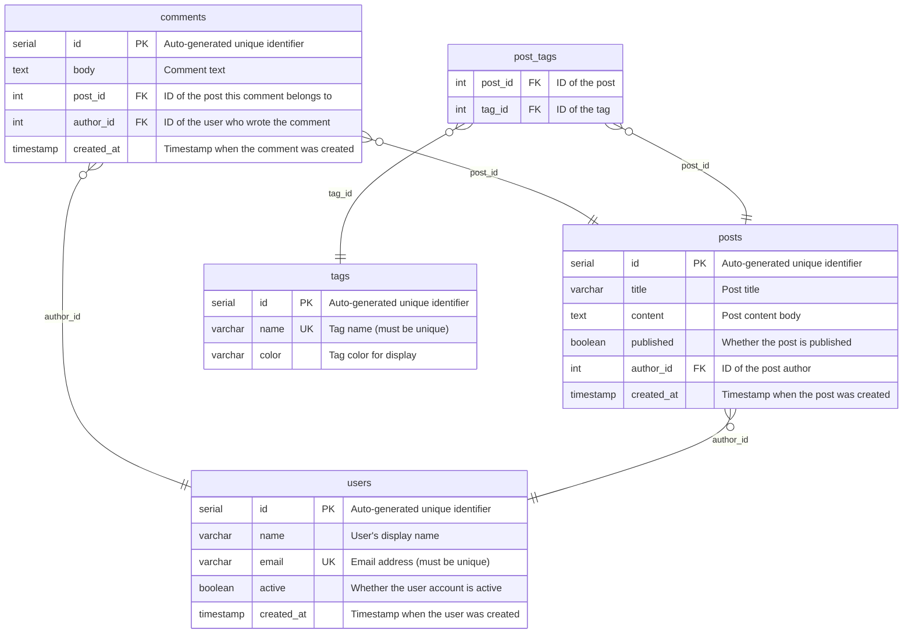

# Tables

| Name | Columns | Comment |
|------|---------|---------|
| [comments](./comments.md) | 5 | Comments on posts |
| [post_tags](./post_tags.md) | 2 | Join table for many-to-many relationship between posts and tags |
| [posts](./posts.md) | 6 | Blog posts created by users |
| [tags](./tags.md) | 3 | Tags for categorizing posts |
| [users](./users.md) | 5 | User accounts table storing basic user information |

---

## ER Diagram

